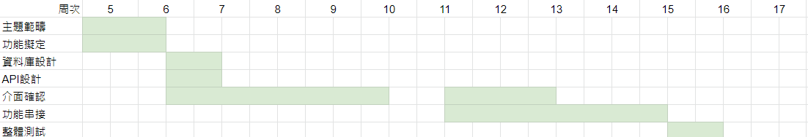
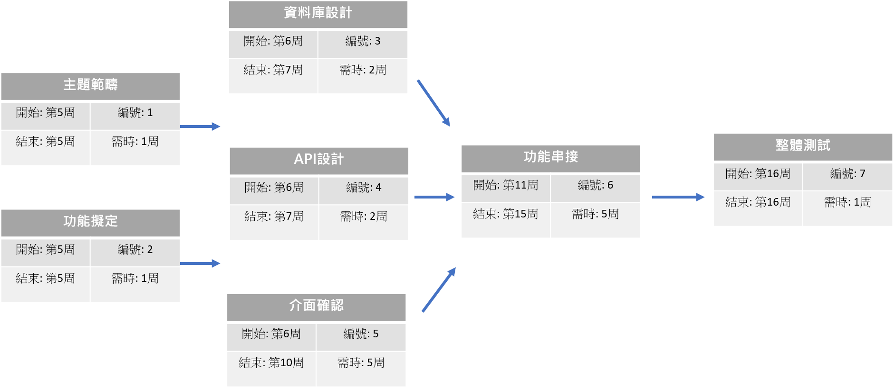

# 2020_OO

## 第五組 

### 組長:洪仁傑

### 小組成員: 黃堃博(DB)、李浩茗(後端)、李永宸(前端)、洪仁傑(PM)
---
## 題目: 銀行管理系統

### 摘要: 行員能夠使用此系統來幫客戶開戶或除戶、客戶也能使用此系統查詢明細和餘額
---
### 甘特圖
 
---
### PERT/CPM
 

### 關鍵路徑: 1 -> 5 -> 6 -> 7

---
### 功能性描述
#### 銀行系統｜功能性描述
* 職員管理：
 * 職員登入
 * 新進職員註冊
* 客戶管理
 * 客戶登入
 * 開戶
 * 除戶
 * 客戶管理資料
* 交易明細管理：可查詢目前存提、轉帳、其他金流紀錄
 * 職員管轄客戶之明細資料
 * 帳戶明細
* 轉帳：於不同帳戶之間進行金流移轉。

#### 電商系統｜功能性描述
* 第三方登入：與銀行系統進行結合，實現第三方登入。
* 產品頁面：顯示Apple產品的頁面，可進行數量與採購選擇。
* 付款機制：連結網路銀行扣款之方式。
* 交易明細：可查詢目前訂單採購數量與顧客資訊。
* 訂單統整：查詢目前顧客訂單記錄。
---

### 非功能性描述

+ 使用性：我們的操作介面非常簡單，使用者在操作過一次之後即可上手
+ 反應時間：Response Time < 3 sec
+ 可靠度：Down time < 1 /week
+ 安全性：不同的用戶具有不同的權限  (例：職員帳號可以進行顧客的開除戶、修改帳戶明細，併將修改的帳戶名稱、日期、摘要和更改內容記錄下來)
+ 系統設計所使用的環境/工具：PHP、HTML5、CSS3、SqlServer、JavaScript
+ 兼容性：系統應支持 Google Chrome、 Safari 、 Microsoft Edge 瀏覽器

---

### 使用者案例
#### 銀行管理系統
##### 1.
| 使用案例名稱 |          註冊         |
| :-----------|:---------------------|
|行動者       |顧客                   |
|說明         |描述註冊過程            |
|完成動作     |1. 點擊客戶端並點選註冊 2. 輸入身分證字號、出生年月日等基本資料，並勾選同意相關條約 3. 設定自己的User ID 和 Password 4. 回報開戶成功   |
|替代方法     |1. 點擊客戶端並點選註冊 2. 輸入身分證字號、出生年月日等基本資料，並勾選同意相關條約 3. 設定自己的User ID 和 Password 4. 回報資料有誤   |
|先決條件 | 無 |
|後置條件 | 開戶完才能進入系統進行其他功能 |
|假設| 無 |
##### 2.
| 使用案例名稱 |          存、提款         |
| :-----------|:---------------------|
|行動者       |顧客                   |
|說明         |描述顧客存、提款的過程            |
|完成動作     |1. 點擊存款或提款 2. 輸入存款或提款的金額 3. 如為提款，先確認原先存款餘額是否足夠 4. 如為提款，原先存款餘額足夠則提款成功   |
|替代方法     |1. 點擊存款或提款 2. 輸入存款或提款的金額 3. 如為提款，先確認原先存款餘額是否足夠 4. 如為提款，原先存款餘額不足則提款失敗   |
|先決條件 | 需先註冊帳號及登錄 |
|後置條件 | 存、提款完仍可繼續使用其他服務 |
|假設| 無 |
#### 電子商務系統
##### 1.
| 使用案例名稱 |          第三方登入         |
| :-----------|:---------------------|
|行動者       |客戶                   |
|說明         |記錄客戶交易及付款方式             |
|完成動作     |1.客戶點擊一件登入鈕 2.與銀行系統連結 3.在電商資料庫中記錄顧客銀行資訊 4.系統畫面顯示註冊完成 |
|替代方法     |1.輸入客戶基本資料與銀行帳號 2.進入銀行系統輸入密碼 3.在電商資料庫中記錄顧客銀行資訊 4.系統畫面顯示註冊完成|
|先決條件 | 客戶必須擁有銀行帳戶。 |
|後置條件 | 帳戶註冊完成，客戶可以登入進行購買與付款功能 |
|假設| 無 |

##### 2.

| 使用案例名稱 |          產品頁面         |
| :-----------|:---------------------|
|行動者       |客戶                   |
|說明         |客戶進行產品選購與暫存交易訂單            |
|完成動作     |1. 顧客先行登入 2.顧客查看產品頁面 3.顧客進行選購 4.點擊加減號，新增購買品項 |
|替代方法    | 1.顧客查看產品頁面 2.顧客進行選購 3.點擊加減號，新增購買品項 |
|先決條件 | 進到頁面。 |
|後置條件 | 帳戶購買完成後，必須點選付款。 |
|假設| 無 |

##### 3.

| 使用案例名稱 |          付款機制         |
| :-----------|:---------------------|
|行動者       |客戶                   |
|說明         |客戶選購完成後，進行付款。           |
|完成動作     |1.客戶點擊結帳 2.系統畫面顯示訂單總金額 3.點選付款 4.與銀行系統申請付款 5.資料庫進行扣款，付款成功 6.將資料庫儲存訂單資訊 7.顯示付款完成|
|替代方法     |1.登入銀行系統 2.選擇轉帳功能 3.輸入電商轉帳帳號 4.輸入轉帳金額 5.將交易序號，填入系統頁面中 |
|先決條件 | 客戶需擁有帳戶 |
|後置條件 | 交易完成，存入交易明細資料庫中。 |
|假設| 無 |

##### 4.
| 使用案例名稱 |          交易明細        |
| :-----------|:---------------------|
|行動者       |商家                   |
|說明         |查看個別顧客的購買資訊        |
|完成動作     |1. 進入頁面 2. 查看客戶交易明細|
|替代方法     |無  |
|先決條件 | 須先登入 |
|後置條件 | 無|
|假設| 無 |

##### 5.
| 使用案例名稱 |          訂單統整        |
| :-----------|:---------------------|
|行動者       |商家                   |
|說明         |將所有產品統整            |
|完成動作     |1. 進入頁面。 2. 查看各項產品。|
|替代方法     |1. 進入較易明細頁面。 2. 一一統計，計算。 |
|先決條件 | 必須有顧客購買 |
|後置條件 | 無 |
|假設| 無 |
