# 2020_OO

## 第五組 

### 組長:洪仁傑

### 小組成員: 黃堃博(DB)、李浩茗(後端)、李永宸(前端)、洪仁傑(PM)
---
## 題目: 銀行管理系統結合電商系統

### 摘要: 行員能夠使用此系統來幫客戶開戶或除戶、客戶也能使用此系統查詢明細和餘額。客戶進到電商系統時，可透過第三方登入，以銀行帳號來登入，付款時也能直接連結銀行帳戶扣款。
---
### 甘特圖
 
---
### PERT/CPM
 
 
### 關鍵路徑: 1 -> 5 -> 6 -> 7
 
 ### FDD(銀行管理)
 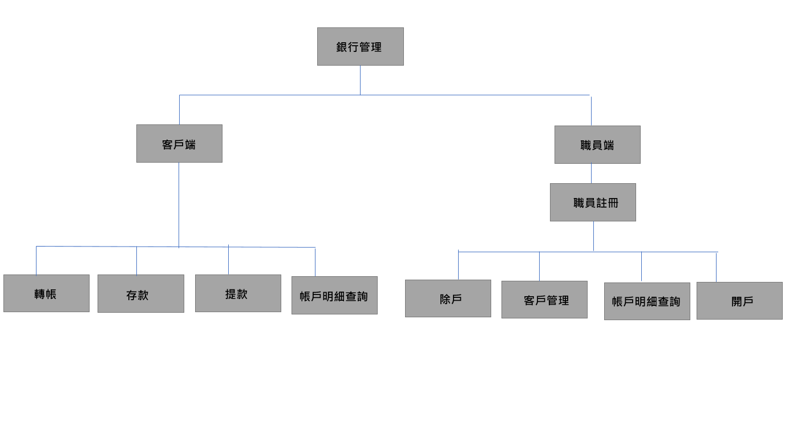
 
 ### FDD(電商系統)
 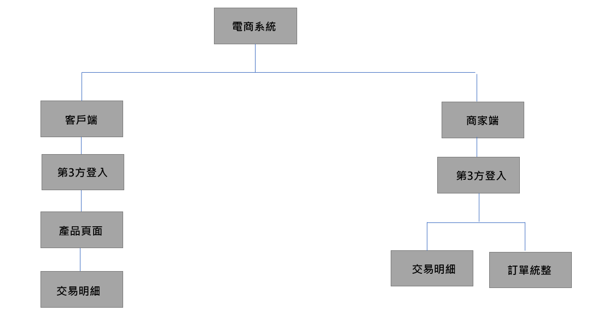
 
 ### UseCase(銀行管理)
 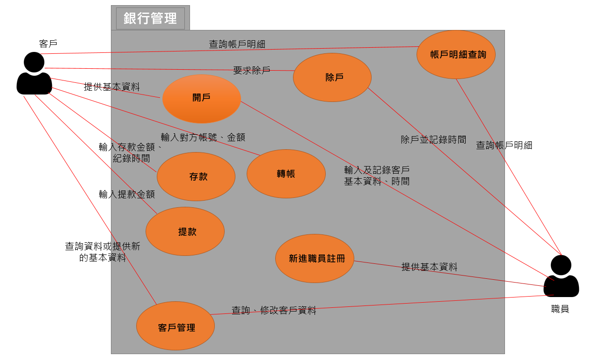
 
 ### 需求分析
 
 一個銀行管理系統的需求分析簡述如下:

1.管理者可以幫客戶開戶、儲戶、帳戶明細查詢。 
2.客戶可自行存款、轉帳、提款。 
3.如有新進職員，可以透過註冊功能來加入新職員。 
4.管理者可以藉由客戶管理來查詢、修改客戶資料。 
5.客戶及管理者都可以查詢帳號明細。 
6.任何對帳戶的異動，都必須記錄時間。 

### UseCase(電商系統)
 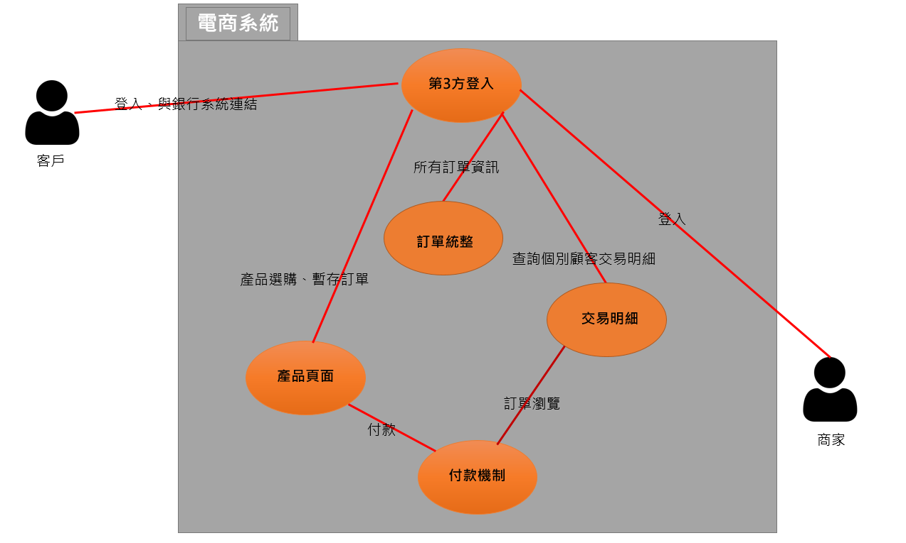
 
 ### 需求分析
 一個電商系統的需求分析簡述如下:

1.可透過銀行帳戶登入。 
2.客戶每完成一筆訂單，都會被記錄到交易明細。 
3.客戶可透過產品頁面，選擇他喜歡的商品。 
4.付款必須連結銀行帳戶扣款。 
5.商家透過訂單統整，可以看到每項商品的訂購資訊。 
6.商家欲想查詢個別顧客的訂單，可透過交易明細達成目的。 

---
### 功能性描述
#### 銀行系統｜功能性描述

* 職員管理：
 > * 職員登入
 > * 新進職員註冊
* 客戶管理
 > * 客戶登入
 > * 開戶
 > * 除戶
 > * 客戶管理資料
* 交易明細管理：可查詢目前存提、轉帳、其他金流紀錄
 > * 職員管轄客戶之明細資料
 > * 帳戶明細
* 轉帳：於不同帳戶之間進行金流移轉。

#### 電商系統｜功能性描述
* 第三方登入：與銀行系統進行結合，實現第三方登入。
* 產品頁面：顯示Apple產品的頁面，可進行數量與採購選擇。
* 付款機制：連結網路銀行扣款之方式。
* 交易明細：可查詢目前訂單採購數量與顧客資訊。
* 訂單統整：查詢目前顧客訂單記錄。
---

### 非功能性描述

+ 使用性：我們的操作介面非常簡單，使用者在操作過一次之後即可上手
+ 反應時間：Response Time < 3 sec
+ 可靠度：Down time < 1 /week
+ 安全性：不同的用戶具有不同的權限  (例：職員帳號可以進行顧客的開除戶、修改帳戶明細，併將修改的帳戶名稱、日期、摘要和更改內容記錄下來)
+ 系統設計所使用的環境/工具：PHP、HTML5、CSS3、SqlServer、JavaScript
+ 兼容性：系統應支持 Google Chrome、 Safari 、 Microsoft Edge 瀏覽器

---

### 使用者案例
#### 銀行管理系統
##### 1.
| 使用案例名稱 |          新進職員註冊         |
| :-----------|:---------------------|
|行動者       |職員                   |
|說明         |描述新進職員註冊過程            |
|完成動作     |1.	職員點擊註冊並輸入基本資料 2.	資料庫紀錄職員資料並記錄職員註冊時間 3.	系統畫面顯示註冊完成   |
|替代方法     |1.	其他職員點擊註冊並輸入基本資料 2.	資料庫紀錄職員資料併紀錄職員註冊時間 3.	系統畫面顯示註冊完成   |
|先決條件 | 職員選擇註冊帳戶，並進入註冊流程 |
|後置條件 | 職員帳戶註冊完成，職員可以登入使用其他功能 |
|假設| 無 |

##### 2.
| 使用案例名稱 |          開戶         |
| :-----------|:---------------------|
|行動者       |職員、客戶                   |
|說明         |描述職員端幫客戶開戶過程            |
|完成動作     |1.	職員點擊客戶開戶並輸入基本資料 2.	資料庫紀錄客戶資料並記錄開戶時間 3.	系統畫面顯示開戶完成   |
|替代方法     |1.	職員點擊客戶開戶並輸入基本資料 2.	資料庫紀錄客戶資料並記錄開戶時間 3.	系統畫面顯示開戶完成   |
|先決條件 | 職員選擇客戶註冊開戶，並進入開戶流程 |
|後置條件 | 開戶註冊完成，客戶可以登入使用其他功能 |
|假設| 無 |

##### 3.
| 使用案例名稱 |          除戶         |
| :-----------|:---------------------|
|行動者       |職員、客戶                   |
|說明         |描述職員端幫客戶除戶過程            |
|完成動作     |1.	職員點擊客戶除戶 2.	資料庫刪除客戶資料並記錄除戶時間 3.	系統畫面顯示除戶完成   |
|替代方法     |1.	職員點擊客戶除戶 2.	資料庫刪除客戶資料並記錄除戶時間 3.	系統畫面顯示除戶完成   |
|先決條件 | 職員選擇客戶除戶，並進入除戶流程 |
|後置條件 | 帳戶除戶完成，客戶將無法登入使用其他功能 |
|假設| 無 |

##### 4.
| 使用案例名稱 |          存款         |
| :-----------|:---------------------|
|行動者       |客戶                   |
|說明         |描述客戶帳戶存款過程            |
|完成動作     |1.	客戶點擊存款 2. 輸入存款的金額 3.	資料庫紀錄客戶存款金額和時間 4. 系統畫面顯示存款完成   |
|替代方法     |1.	客戶點擊存款 2. 輸入存款的金額 3.	資料庫紀錄客戶存款金額和時間 4. 系統畫面顯示存款完成   |
|先決條件 | 客戶需先登入並選擇存款，進入存款流程 |
|後置條件 | 帳戶存款完成，客戶可以繼續使用其他功能 |
|假設| 無 |

##### 5.
| 使用案例名稱 |          提款         |
| :-----------|:---------------------|
|行動者       |客戶                   |
|說明         |描述客戶帳戶提款過程            |
|完成動作     |1.	客戶點擊提款 2. 輸入提款的金額 3.	確認客戶原先存款餘額是否足夠 4.	資料庫紀錄客戶提款金額和時間 5. 系統畫面顯示提款完成 6.	餘額不足時則顯示提款失敗  |
|替代方法     |1.	客戶點擊提款 2. 輸入提款的金額 3.	確認客戶原先存款餘額是否足夠 4.	資料庫紀錄客戶提款金額和時間 5. 系統畫面顯示提款完成 6.	餘額不足時則顯示提款失敗   |
|先決條件 | 客戶需先登入並選擇提款，進入提款流程 |
|後置條件 | 帳戶提款完成，客戶可以繼續使用其他功能 |
|假設| 無 |

##### 6.
| 使用案例名稱 |          轉帳         |
| :-----------|:---------------------|
|行動者       |客戶                   |
|說明         |描述客戶帳戶轉帳過程            |
|完成動作     |1.	客戶點擊轉帳 2. 輸入轉帳的金額 3.	確認客戶原先存款餘額是否足夠 4.	資料庫紀錄客戶轉帳金額和雙方帳號及時間 5. 系統畫面顯示轉帳完成 6.	餘額不足時則顯示轉帳失敗  |
|替代方法     |1.	客戶點擊轉帳 2. 輸入轉帳的金額 3.	確認客戶原先存款餘額是否足夠 4.	資料庫紀錄客戶轉帳金額和雙方帳號及時間 5. 系統畫面顯示轉帳完成 6.	餘額不足時則顯示轉帳失敗   |
|先決條件 | 客戶選擇轉帳帳戶，並進入轉帳流程 |
|後置條件 | 帳戶轉帳完成，客戶可以繼續使用其他功能 |
|假設| 無 |

##### 7.
| 使用案例名稱 |          客戶管理         |
| :-----------|:---------------------|
|行動者       |職員                   |
|說明         |描述職員管理客戶帳戶過程            |
|完成動作     |1.	職員點擊客戶管理並修改客戶資料 2.	資料庫紀錄客戶資料 3.	系統畫面顯示註冊完成  |
|替代方法     |1.	職員點擊客戶管理並修改客戶資料 2.	資料庫紀錄客戶資料 3.	系統畫面顯示註冊完成   |
|先決條件 | 客戶選擇註冊帳戶，並進入註冊流程 |
|後置條件 | 帳戶註冊完成，客戶可以登入使用其他功能 |
|假設| 無 |

##### 8.
| 使用案例名稱 |          帳戶明細查詢         |
| :-----------|:---------------------|
|行動者       |客戶                   |
|說明         |描述客戶查詢帳戶明細過程            |
|完成動作     |1.	客戶點擊帳戶明細查詢 2.	系統畫面顯示帳戶明細  |
|替代方法     |1.	點擊帳戶明細查詢 2.	系統畫面顯示帳戶明細   |
|先決條件 | 客戶選擇帳戶明細查詢，並進入查詢流程 |
|後置條件 | 帳戶查詢完成，客戶可以繼續使用其他功能 |
|假設| 無 |

---

### 電子商務系統
##### 1.
| 使用案例名稱 |          第三方登入         |
| :-----------|:---------------------|
|行動者       |客戶、商家                   |
|說明         |記錄客戶、商家登入作業             |
|完成動作     |1.點擊一件登入鈕 2.與銀行系統連結 3.在電商資料庫中記錄顧客銀行資訊 4.系統畫面顯示註冊完成 |
|替代方法     |1.輸入基本資料與銀行帳號 2.進入銀行系統輸入密碼 3.在電商資料庫中記錄顧客銀行資訊 4.系統畫面顯示註冊完成|
|先決條件 | 必須擁有銀行帳戶。 |
|後置條件 | 帳戶註冊完成，可以登入進行購買與付款功能，商家可進行管理 |
|假設| 無 |

##### 2.

| 使用案例名稱 |          產品頁面         |
| :-----------|:---------------------|
|行動者       |客戶                   |
|說明         |客戶進行產品選購與暫存交易訂單            |
|完成動作     |1. 顧客先行登入 2.顧客查看產品頁面 3.顧客進行選購 4.點擊加減號，新增購買品項 |
|替代方法    | 1.顧客查看產品頁面 2.顧客進行選購 3.點擊加減號，新增購買品項 |
|先決條件 | 進到頁面。 |
|後置條件 | 帳戶購買完成後，必須點選付款。 |
|假設| 無 |

##### 3.

| 使用案例名稱 |          付款機制         |
| :-----------|:---------------------|
|行動者       |客戶                   |
|說明         |客戶選購完成後，進行付款。           |
|完成動作     |1.客戶點擊結帳 2.系統畫面顯示訂單總金額 3.點選付款 4.與銀行系統申請付款 5.資料庫進行扣款，付款成功 6.將資料庫儲存訂單資訊 7.顯示付款完成|
|替代方法     |1.登入銀行系統 2.選擇轉帳功能 3.輸入電商轉帳帳號 4.輸入轉帳金額 5.將交易序號，填入系統頁面中 |
|先決條件 | 客戶需擁有帳戶 |
|後置條件 | 交易完成，存入交易明細資料庫中。 |
|假設| 無 |

##### 4.
| 使用案例名稱 |          交易明細        |
| :-----------|:---------------------|
|行動者       |商家                   |
|說明         |查看個別顧客的購買資訊        |
|完成動作     |1. 進入頁面 2. 查看客戶交易明細|
|替代方法     |無  |
|先決條件 | 須先登入 |
|後置條件 | 無|
|假設| 無 |

##### 5.
| 使用案例名稱 |          訂單統整        |
| :-----------|:---------------------|
|行動者       |商家                   |
|說明         |將所有產品統整            |
|完成動作     |1. 進入頁面。 2. 查看各項產品。|
|替代方法     |1. 進入較易明細頁面。 2. 一一統計，計算。 |
|先決條件 | 必須有顧客購買 |
|後置條件 | 無 |
|假設| 無 |
---
### 資料流向圖 DFD
#### 銀行｜系統分析圖
 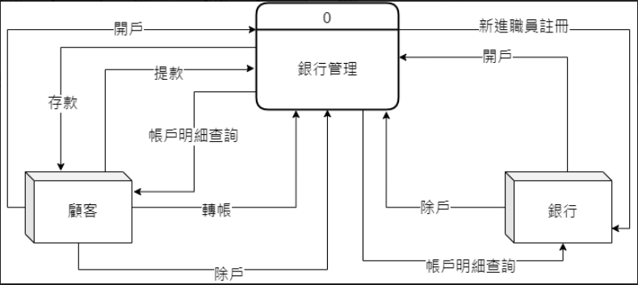

#### 銀行｜圖0
 

#### 電商｜系統環境圖
 

#### 電商｜圖0
 
---

### UML類別圖
 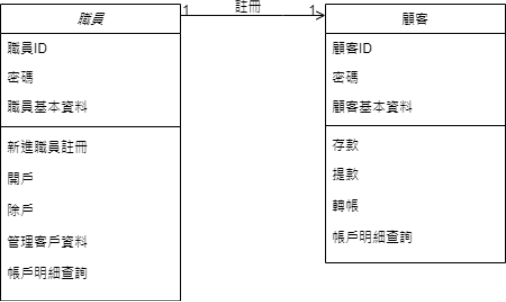

### 活動圖
#### 新進員工註冊
 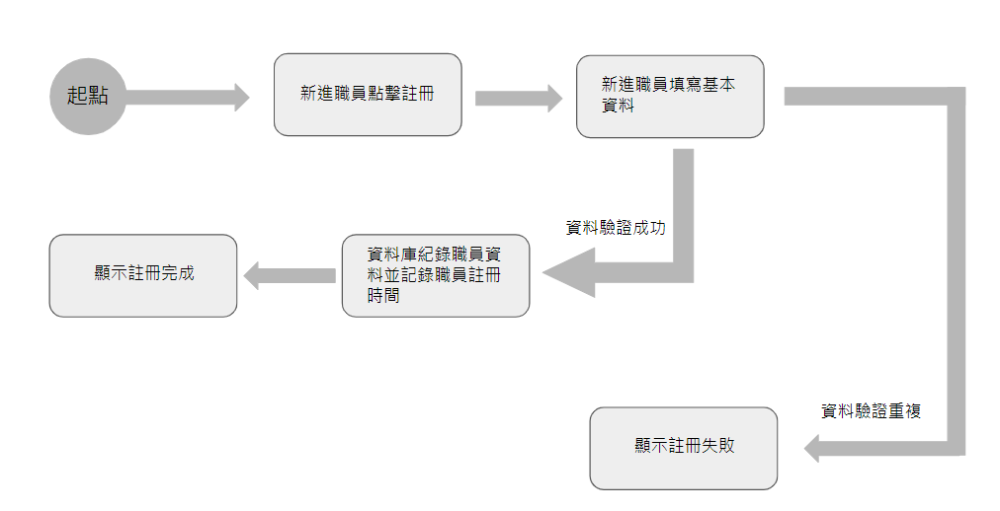
 
#### 開戶
 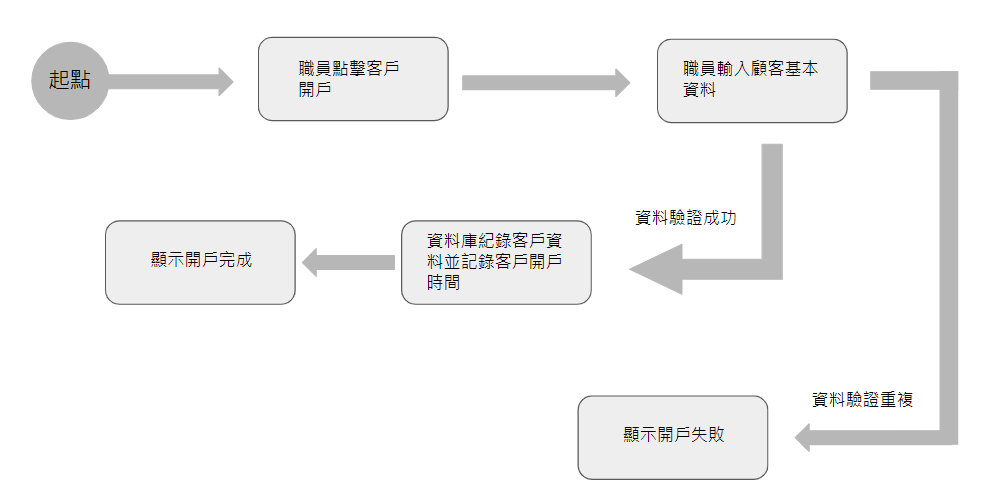
 
#### 除戶
 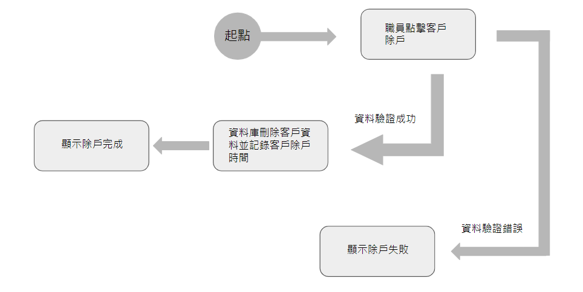
 
#### 存款
 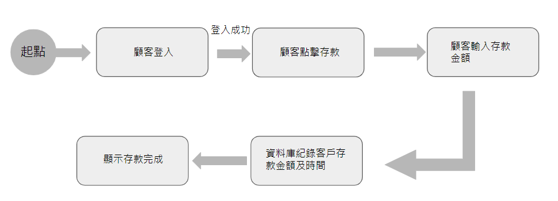
 
#### 提款
 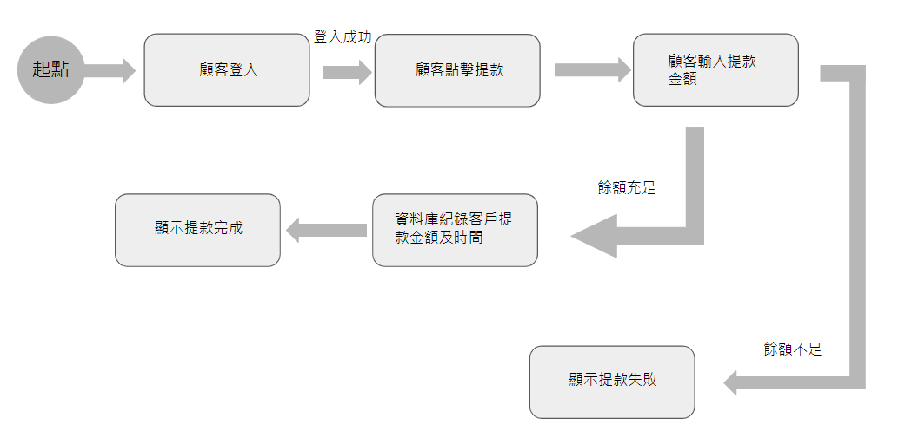
 
#### 轉帳
 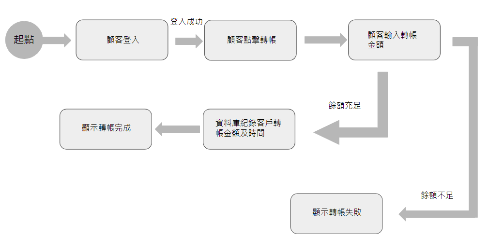
 
#### 客戶管理
 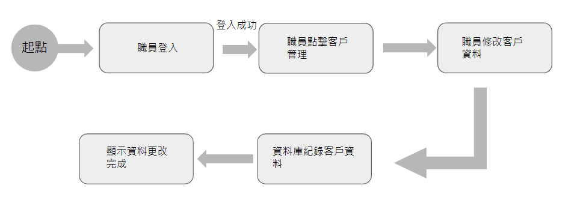
 
#### 客戶明細查詢
 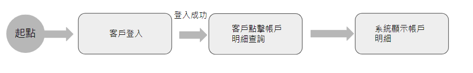
 
 
 ### 循序圖
#### 新進員工註冊
 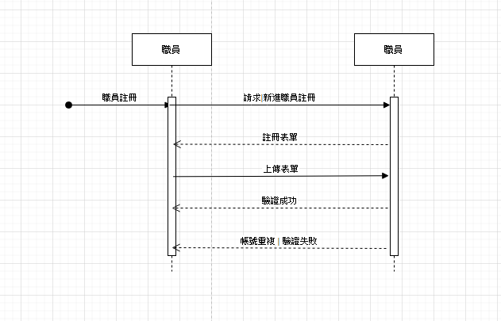
 
#### 開戶
 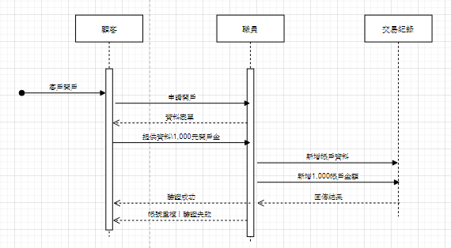
 
#### 除戶
 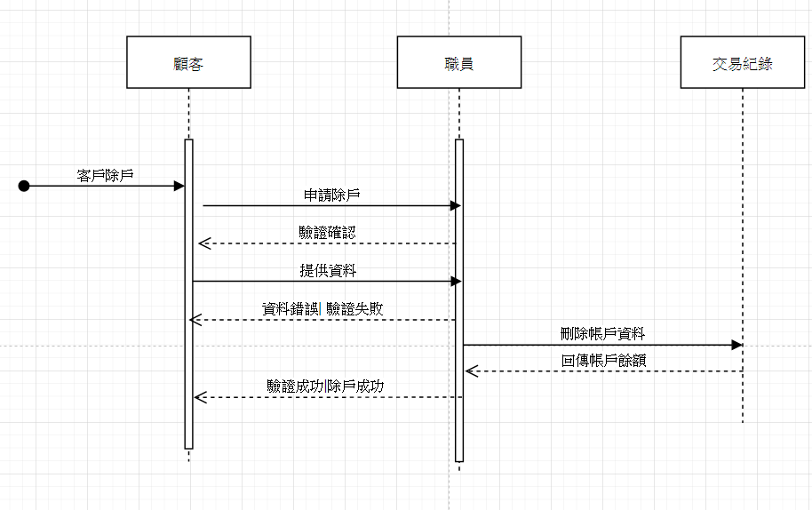
 
#### 存款
 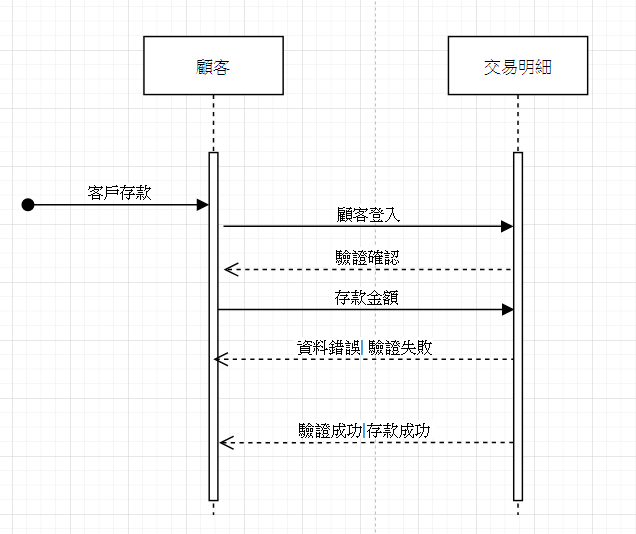
 
#### 提款
 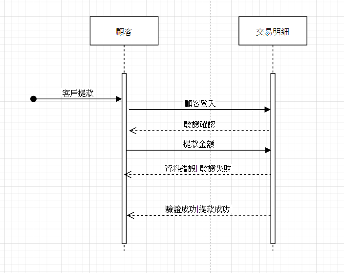
 
#### 轉帳
 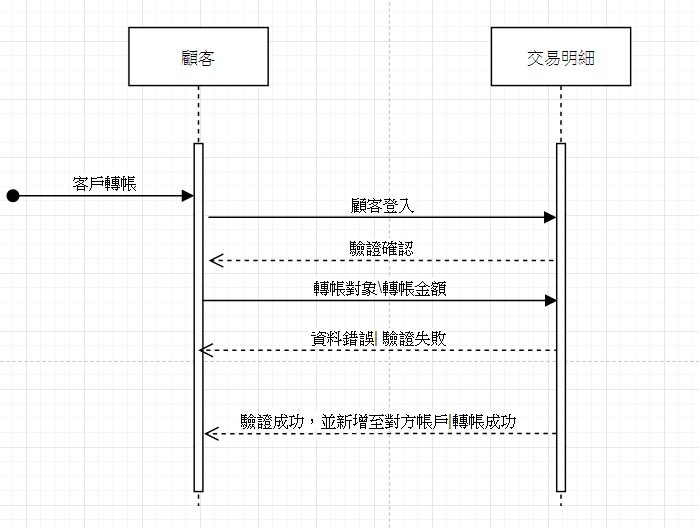
 
#### 客戶管理
 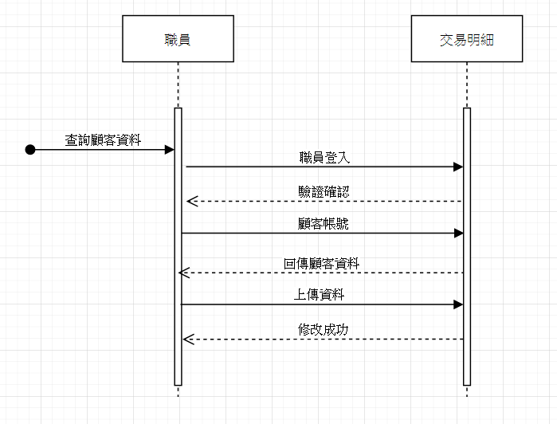
 
#### 客戶明細查詢
 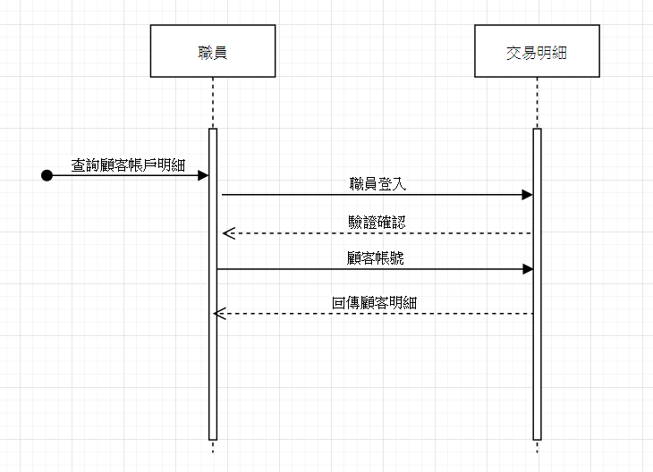
 
 
 ### 分鏡圖
 #### 帳戶動作操作
 
 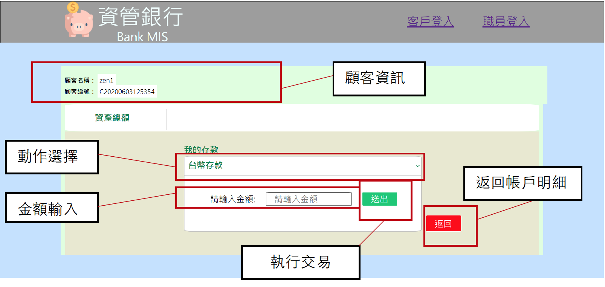
  | 介面名稱 |          簡介         |
| :-----------|:---------------------|
|顧客資訊       |會顯示當前使用系統的顧客資訊。                   |
|動作選擇       |使用下拉選單的方式，使顧客能夠選擇想要的交易動作，如：存、提款或是轉帳。                   |
|金額輸入       |使用輸入框，主要用於輸入金額，不可輸入小於零的數字。若輸入小於零的數字，在點擊送出時，會跳出警告，輸入框會呈現紅色字體。|
|執行交易       |會偵測目前帳戶額度與金額欄位的資料是否正確，若是金額小於零會跳出警示；餘額不足會跳出提示窗，提醒餘額不足。                   |
|返回帳戶明細    |返回上一頁的功能，會跳出確認框確認是否要離開。                   |
 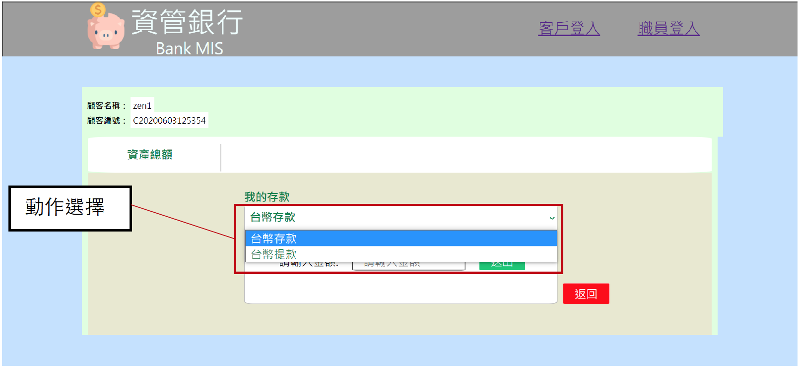
 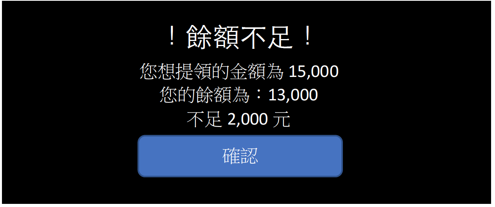
 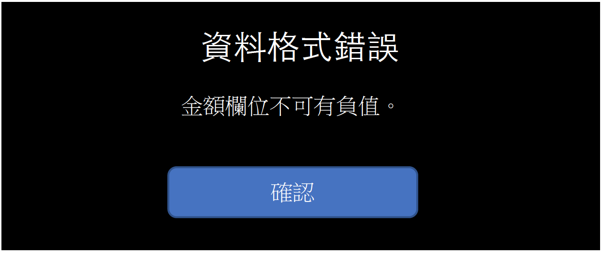
 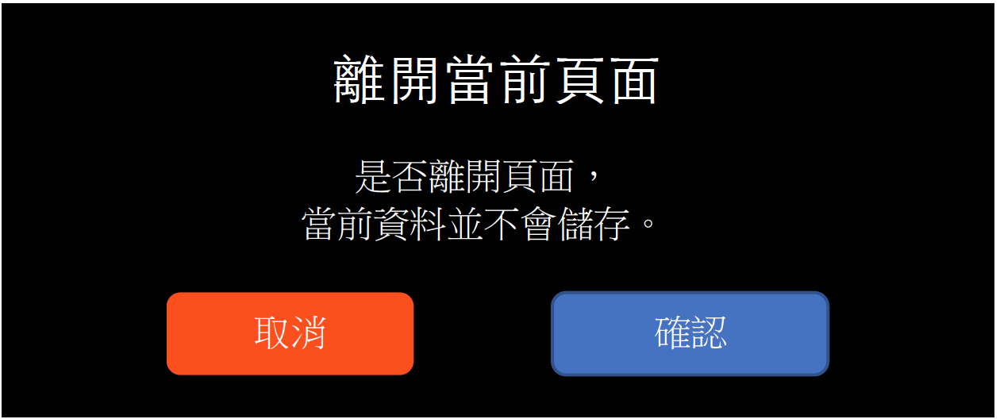

